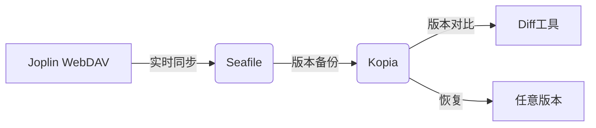

# 高级备份方法

写一个使用 webdav 同步 Joplin 笔记后，如何在本地备份 webdav 的方法。

以 seafile 为例，安装 seafile ，将同步笔记的 webdav 实时同步到本地；

使用 Kopia 计划任务每10 分钟备份一个版本；

使用 Kopia 的 diff 功能可实现版本比较；

使用 Kopia 的版本管理可恢复任意文件

高级用法： 如果觉得没有显示的文件名不好用，用 python 写一个文件名识别的脚本，批量列出笔记的标题，更好地 diff

Response:

（注： 以下回答以 Linux 上的 Kopia 命令行为例，也可用 Kopia-UI 的特形化版本）

以下是基于 WebDAV + Seafile + Kopia 的 Joplin 笔记自动化备份方案，包含高级文件名识别功能：

---

### **Joplin WebDAV 笔记本地备份系统**
#### 一、基础架构设计


#### 二、具体实施步骤
##### 1. **Seafile 实时同步 WebDAV**

如果直接使用第三方服务器，如 Nextcloud，可直接配置 WebDAV 同步。跳过下面的 Seafile 服务器的安装与配置步骤。

**配置 Seafile WebDAV**

```bash
# 在 Linux 服务器安装 Seafile
wget https://download.seadrive.org/seafile-server_9.0.4_x86-64.tar.gz
tar -xzf seafile-server_*.tar.gz
cd seafile-server-* && ./setup-seafile.sh

# 配置 WebDAV 同步
vi conf/seafdav.conf
```
```ini
[WEBDAV]
enabled = true
port = 8080
fastcgi = false
share_name = /joplin_webdav
```

**安装 Seafile 客户端**

如果需要同步的笔记体积只有200M左右，可以直接在本地安装 Seafile 客户端，配置 WebDAV 同步。这样就可以免费使用 Seafile 的 1G 空间的 WebDAV 功能。


##### 2. **Kopia 定时备份配置**

**Linux 系统上的命令行方法**

未验证，改用 Kopia-UI 后，会简单很多

```bash
# 创建 Kopia 仓库
kopia repository create filesystem --path=/backup/joplin --password=YourStrongPassword

# 设置每10分钟快照策略
kopia policy set /mnt/seafile/joplin_data \
  --snapshot-interval=10m \
  --keep-daily=7 \
  --keep-weekly=4 \
  --keep-monthly=12
```


##### 3. **版本对比与恢复**
```bash
# 查看版本历史
kopia snapshot list /mnt/seafile/joplin_data

# 差异对比（需安装 diffutils）
kopia snapshot diff <snapshot1> <snapshot2> | colordiff

# 恢复特定版本
kopia restore <snapshot-id> --target=/recovery/path
```

#### 三、高级文件名识别方案
##### Python 脚本：Joplin 元数据解析器
```python
#!/usr/bin/env python3
import sqlite3, json
from pathlib import Path

def map_joplin_files(profile_path):
    db = sqlite3.connect(f"{profile_path}/database.sqlite")
    cursor = db.cursor()
    
    # 查询笔记标题和关联资源
    cursor.execute("""
    SELECT notes.title, resources.id, resources.title 
    FROM resources 
    JOIN note_resources ON resources.id = note_resources.resource_id
    JOIN notes ON note_resources.note_id = notes.id
    """)
    
    mapping = {}
    for note_title, res_id, res_name in cursor.fetchall():
        orig_name = res_name or f"unnamed_{res_id[:8]}"
        mapping[f"{res_id[:2]}/{res_id}"] = f"{note_title[:20]}_{orig_name}"
    
    return mapping

if __name__ == "__main__":
    profile = Path.home() / ".config/joplin-desktop"
    mapping = map_joplin_files(profile)
    
    # 生成可读的符号链接
    backup_dir = Path("/mnt/seafile/joplin_data")
    for src, dst in mapping.items():
        (backup_dir / dst).symlink_to(backup_dir / src)
```


### **方案优势**
1. **实时性**：Seafile 确保 WebDAV 内容即时落地到磁盘
2. **版本追溯**：Kopia 提供精确到10分钟粒度的版本控制
3. **可读性**：Python 脚本通过数据库映射生成友好文件名
4. **原子性**：每个快照都是完整可用的状态点

> **注意事项**：操作 Joplin 数据库前建议关闭客户端，Seafile 和 Kopia 需配置 HTTPS 以保证传输安全。